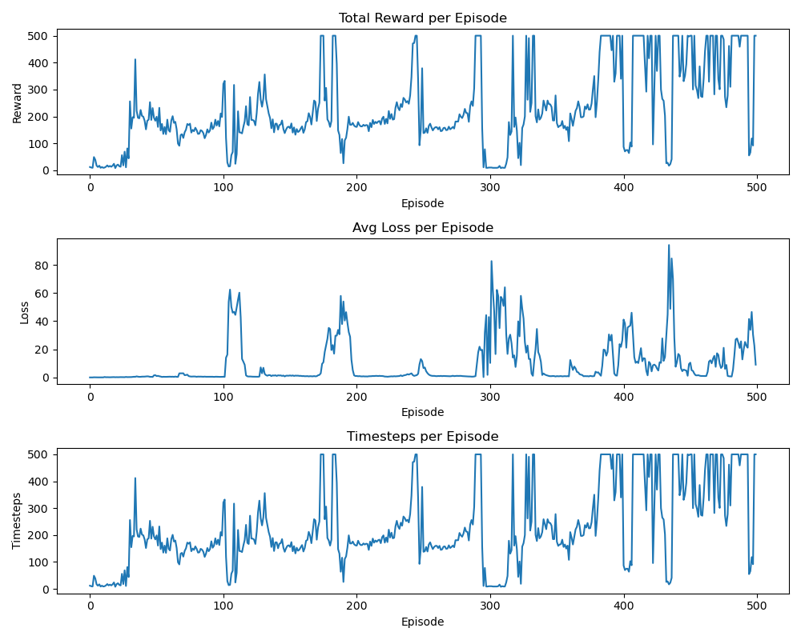
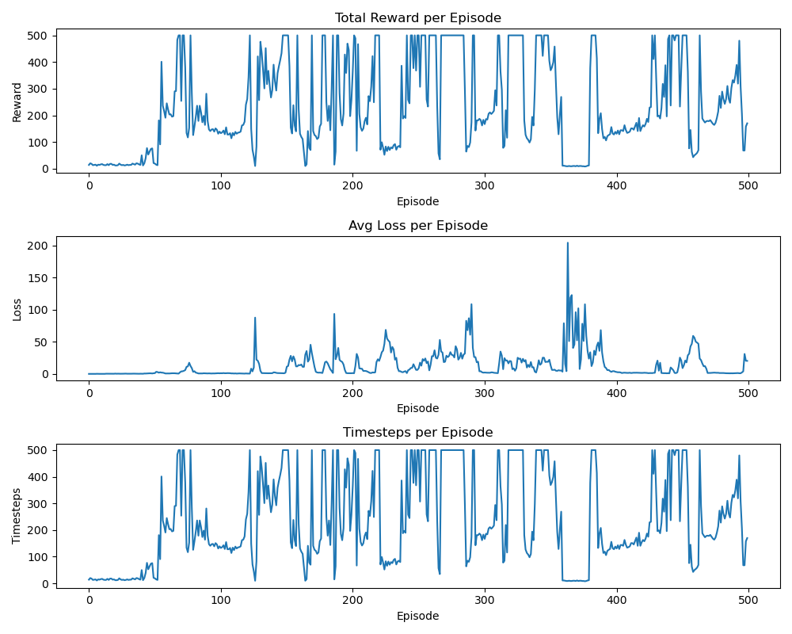

# DQN with Replay Buffer — CartPole-v1

## Algorithm

Deep Q-Network (DQN) with experience replay and a target network, trained on the CartPole-v1 environment.

---

## Training Observations (Run 1 — 500 Episodes)

## Key Hyperparameters
| Parameter | Value |
|---|---|
| discount | 0.99 |
| Epsilon (timestep decay) | 0.1 |
| Batch size | 32 |
| Learning rate | 0.001 |
| Replay buffer size | 1000 |
| Target network update | every 100 steps |
| Optimizer | RMSprop |

### What worked
- Agent learned to balance the pole, frequently hitting the max reward of 500 by episode 400+
- Overall upward trend in reward confirms the DQN algorithm is functioning as expected

### Catastrophic Forgetting
- Sharp reward crashes at ~ep 300 and ~ep 430 after previously high performance
- Hypothesis Root cause: replay buffer size of 1000 is too small — good experiences get evicted quickly, causing the network to overfit recent bad transitions.

### Loss Spikes Correlate with Reward Crashes
- Loss spikes at ~ep 100, ~180, ~300, ~430 directly precede reward crashes
- High loss indicates the target and prediction Q-values have diverged

### Epsilon Decay Too Aggressive
- `epsilon * 0.99` applied **per step** causes epsilon to collapse to ~0 within the first 50-100 episodes
- The agent stops exploring early and cannot recover from local optima after crashes

---

## Follow ups
1. **Increase replay buffer** to 10,000–100,000 to preserve diverse experiences
2. **Decay epsilon per episode**, not per step — or enforce a minimum: `max(epsilon * 0.995, 0.01)`
3. **Increase `WEIGHT_TRANSFER_CYCLES`** (e.g. 500–1000) to reduce instability from abrupt target network updates

## Training Observations (Run 2 — 500 Episodes)

What changed: Changed epsilon to decay per episode

## Key Hyperparameters Changes
| Parameter | Value |
|---|---|
| Epsilon (episode decay) | 0.1 |

## How is this change reflected?
| Observation | Run 1 | Run 2 |
|---|---|---|
| First 500-reward episode | ~ep 170 | ~ep 100 (earlier!) |
| Stable high-reward region | eps 350–500 | eps 100–300 (broader) |
| Worst loss spike | ~85 | ~200 (much worse) |

## Notes:
- Since we changed the decay to episodic, we decay slower. (~ 0.01 by 200th episode instead of 200 step)
- Sooner 500 reward means the agent explores earlier and scores sooner.
- Broader high reward range might indicate systemic learning (instead of being stuck in local optima).
- Higher loss spike is expected because of exploration.

## What needs improving:
- We still see sharp reward crashes (at ~350th episode) indicating catastropic forgetting.

## Overall
Not a dramatic improvement, we want to avoid catastrophic forgetting and want the loss and rewards graph to be relatively stable.

## Follow ups:
- Increase the size of replay buffer
- Use prioritized experience replay
- Increase weight transfer cycles?