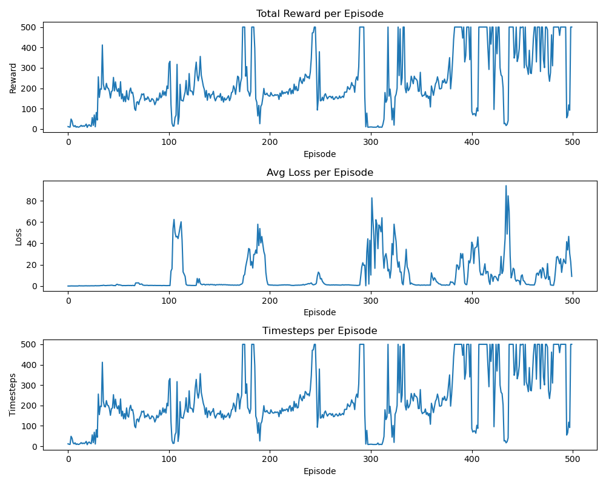
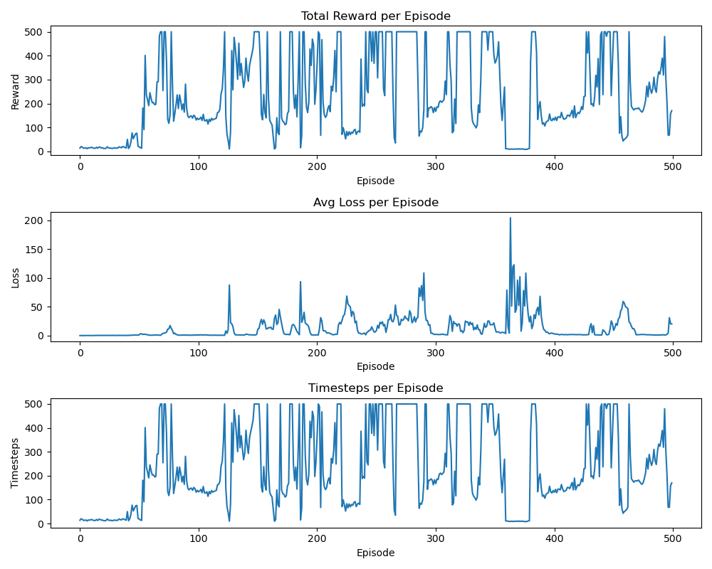
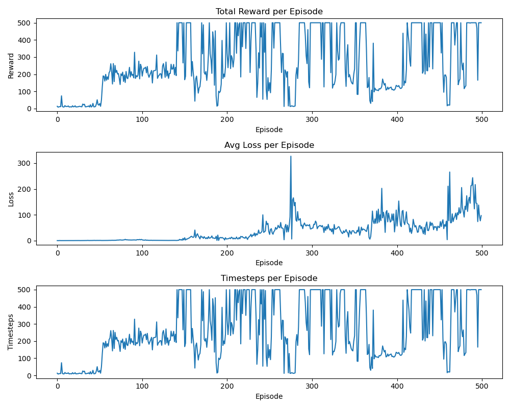
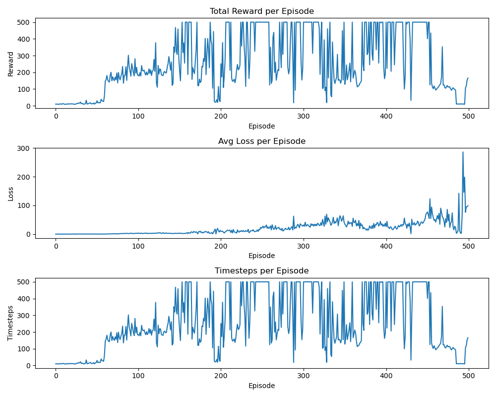
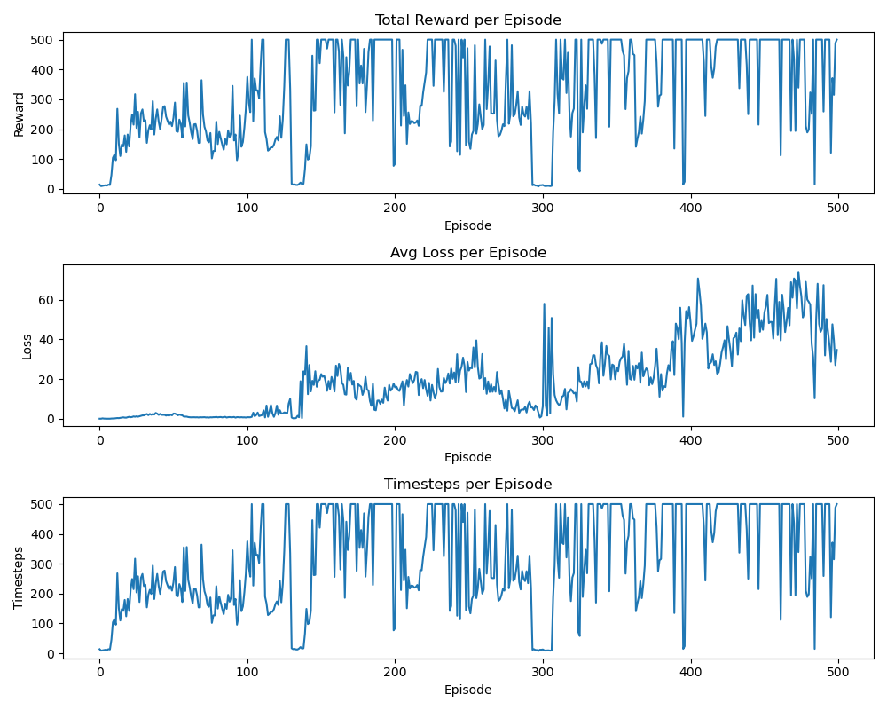

# DQN with Replay Buffer — CartPole-v1

## Algorithm

Deep Q-Network (DQN) with experience replay and a target network, trained on the CartPole-v1 environment.

---

## Training Observations (Run 1 — 500 Episodes)

## Key Hyperparameters
| Parameter | Value |
|---|---|
| discount | 0.99 |
| Epsilon (timestep decay) | 0.1 |
| Batch size | 32 |
| Learning rate | 0.001 |
| Replay buffer size | 1000 |
| Target network update | every 100 steps |
| Optimizer | RMSprop |

### What worked
- Agent learned to balance the pole, frequently hitting the max reward of 500 by episode 400+
- Overall upward trend in reward confirms the DQN algorithm is functioning as expected

### Catastrophic Forgetting
- Sharp reward crashes at ~ep 300 and ~ep 430 after previously high performance
- Hypothesis Root cause: replay buffer size of 1000 is too small — good experiences get evicted quickly, causing the network to overfit recent bad transitions.

### Loss Spikes Correlate with Reward Crashes
- Loss spikes at ~ep 100, ~180, ~300, ~430 directly precede reward crashes
- High loss indicates the target and prediction Q-values have diverged

### Epsilon Decay Too Aggressive
- `epsilon * 0.99` applied **per step** causes epsilon to collapse to ~0 within the first 50-100 episodes
- The agent stops exploring early and cannot recover from local optima after crashes

---

## Follow ups
1. **Increase replay buffer** to 10,000–100,000 to preserve diverse experiences
2. **Decay epsilon per episode**, not per step — or enforce a minimum: `max(epsilon * 0.995, 0.01)`
3. **Increase `WEIGHT_TRANSFER_CYCLES`** (e.g. 500–1000) to reduce instability from abrupt target network updates

## Training Observations (Run 2 — 500 Episodes)

What changed: Changed epsilon to decay per episode

## Key Hyperparameters Changes
| Parameter | Value |
|---|---|
| Epsilon (episode decay) | 0.1 |

## How is this change reflected?
| Observation | Run 1 | Run 2 |
|---|---|---|
| First 500-reward episode | ~ep 170 | ~ep 100 (earlier!) |
| Stable high-reward region | eps 350–500 | eps 100–300 (broader) |
| Worst loss spike | ~85 | ~200 (much worse) |

## Notes:
- Since we changed the decay to episodic, we decay slower. (~ 0.01 by 200th episode instead of 200 step)
- Sooner 500 reward means the agent explores earlier and scores sooner.
- Broader high reward range might indicate systemic learning (instead of being stuck in local optima).
- Higher loss spike is expected because of exploration.

## What needs improving:
- We still see sharp reward crashes (at ~350th episode) indicating catastropic forgetting.

## Overall
Not a dramatic improvement, we want to avoid catastrophic forgetting and want the loss and rewards graph to be relatively stable.

## Follow ups:
- Increase the size of replay buffer
- Use prioritized experience replay
- Increase weight transfer cycles?

## Training Observations (Run 3 — 500 Episodes)

What changed: Changed buffer size to 10000

## Key Hyperparameters Changes
| Parameter | Value |
|---|---|
| Replay buffer size | 10000 |

## How is this change reflected?
| Observation | Run 1 | Run 2 |
|---|---|---|
| Total timesteps | ~110k | ~130k |
| Crash character | One hard crash, slow recovery | Multiple shorter crashes, faster recovery |
| loss | mostly flat, looks better | ramp to ~300, stays noisy |

## Notes:
- Total timesteps improved by 20%, this looks like a direct causation of the buffer size increase.
- Loss pattern is gradual ramp to 300, maybe its healthy?
- Catastrophic forgetting still occurs

## Overall
Definitely improved but the catastrophic forgetting still occurs.

## Follow ups:
- We do not randomize the buffer entries. This means the entries are in the sequential order. Although, this wouldn't influence the sample method, we would evict the data in serialized order. This doesn't respect I.I.D. to actually learn the Markov property.
- After 200 episodes agent is fully greedy. Apply, max(epsilon, 0.01)

## Training Observations (Run 4 — 500 Episodes)

What changed: Added shuffle to buffer once every 250 additions to aid the I.I.D property

## Notes:
- Large crash (catastrophic forgetting) towards the end
- Model does good until 450 episodes.

## Overall
Philosophically, having FIFO confines both good/bad experiences to one region of the buffer. This means, they get evicted all at once. Shuffle changes this property. With shuffle, the there is no regional confinement of good/bad experiences. Plausible mechanistic story for the skyrocket loss at the end: By episode 480, buffer is full of mostly "good" 500-reward trajectories. With FIFO, the oldest (worst, early-training) experiences would have long been evicted. With shuffle, some of those ancient, off-policy experiences from episode 10-50 might still be sitting in the buffer because they got shuffled into high-index positions that the write pointer hasn't reached yet. Those stale transitions have huge TD errors against the current Q-network, which produces a loss spike when a batch happens to sample several of them. That loss spike destabilizes the policy, which generates bad new experiences, which compounds — a brief catastrophic feedback loop.

## Follow ups:
- Remove shuffle
- Add epsilon floor for continued epsilon greedy

## Training Observations (Run 5 — 500 Episodes)

What changed: Added epsilon floor = 0.01

## Notes:
- Huge drop in loss (max loss 60).
- Consistently maxing episodic after 300th episode.
- exploration helps with catastrophic forgetting.
- Total max rewards ~160k (compared to ~130k in experiment 3)

## Overall
Exploration helps model to bring it out of catastropic forgeting phases. When there is an exploration floor, the mechanism provides against catastrophic forgetting / policy collapse.  Without a floor, epsilon eventually hits something like 0.013 by episode 200 (experiment 3). At that point, the agent almost never explores, so if the Q-network drifts into slightly wrong value estimates (due to bootstrapping error compounding), it has no corrective signal i.e., it just follows its increasingly wrong greedy policy into a death spiral. That 1% exploration floor acts as a safety valve: enough random actions to occasionally stumble into corrective experiences that keep the Q-values grounded. 

## Follow ups:
- DDQN?
- Prioritized experience replay
- Visualize weights using t-SNE?

## Reflecting DQN vs Q-learning

Now is a good segway into why DQN was innovated over Q-learning, the problems it solves (sample correlation, moving targets), the new problem it introduces (maximization bias), and how Double DQN addresses it.

See [DQN_vs_QLearning.md](DQN_vs_QLearning.md) for the full writeup. 